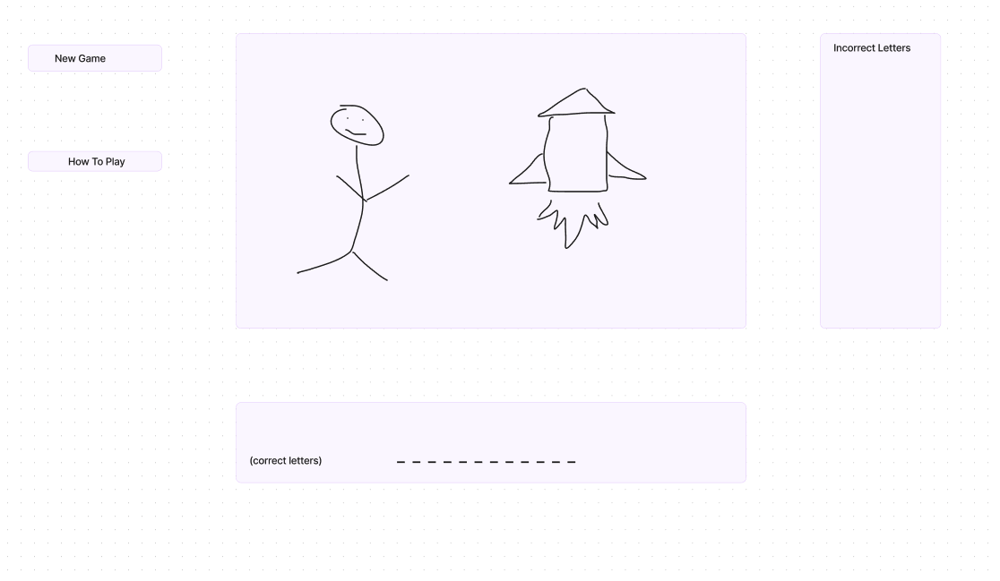

# project-1
Spaceman Game

# Wireframes

#  User Stories

## MVP
- As a user, I want to see my correct letter guesses.
- As a user, I want to see my incorrect letter guesses.
- As a user, I want to see how many incorrect guesses I have left before I lose.
- As a user, I want to be notified when I have won.
- As a user, I want to be notified when I have lost.
- As a user, I want a be able to restart the game whenever I want.

## Version 2
- As a user, I want to be able to ask for a hint.
- As a user, I want to see the parts of the rocket get added on with each incorrect guess.
- As a user, I want the option to guess a word from a certain category.
- As a user, I want the option to guess multi-word answers.

## Version 3
- As a user, I want a counter of how many times I've won and lost.
- As a user, I want an animation of the rocket taking off after I lose.
- As a user, I want an animation of the stick figure celebrating after I win.

# Pseudocode

## MVP
- Random word is chosen
    - Word is shown with underscores representing each letter

- Letter is guessed
    - If letter is correct
        - letter will take it's proper place, removing the underscore
    - If letter is incorrect
        - letter will be shown in the "incorrect" box
    - If letter is incorrect
        - "Lives" will be decreased by 1

- When the word is guessed correctly
    - Alert the user they have won

- When number of incorrect guesses is greater than lives left
    - Alert the user they have lost

- User can play again by hitting "new game" button

## Version 2
- Hint button shows a clue for the answer

- If letter is guessed incorrectly
     - A part of the rocket will be drawn

- If "category" button is pressed
    - shows different categories to choose from for hidden word
    - also shows option to guess phrases

- If "how to play" button is pressed
    - explanation of rules shows up on screen

## Version 3
- If user guesses word correctly
    - Show animation of stick figure celebrating
    - Add 1 to the "win" column

- If user fails to to guess word within the amount of alotted lives
    - Show animation of the rocket taking off
    - Add 1 to the "loss" column
